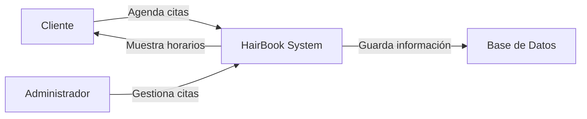

# 💇 HairBook – System Brief

---

## 📌 Visión del Sistema

**HairBook** es una plataforma web diseñada para facilitar la gestión de citas en peluquerías.  
Permite que los clientes reserven citas en línea mientras que los administradores pueden organizar y supervisar la agenda de servicios de manera eficiente.

El sistema busca digitalizar el proceso de reservación para reducir errores, mejorar la organización y optimizar la experiencia del cliente.

---

## ⚠️ Problema

Muchas peluquerías no tienen citas o si las tienen son mediante llamadas telefónicas o mensajes en redes sociales.

Esto genera problemas como:

- ❌ Conflictos de horarios
- ❌ Falta de organización
- ❌ Pérdida de clientes
- ❌ Dificultad para llevar control de la agenda

---

## 💡 Solución

HairBook proporciona una plataforma donde:

- Los **clientes** pueden consultar horarios disponibles y reservar citas.
- Los **administradores** pueden gestionar la agenda y visualizar las citas registradas.

Esto permite mejorar la organización del negocio y ofrecer una experiencia más moderna a los clientes.

---

## 👥 Stakeholders

| Rol | Descripción |
|----|----|
| Cliente | Persona que desea reservar una cita en la peluquería |
| Peluquero | Profesional que se encarga de los servicios |
| Administrador | Persona encargada de gestionar las citas |

---

## 📦 Alcance del Sistema (Scope)

El sistema incluirá las siguientes funcionalidades principales:

- Registro de usuarios
- Inicio de sesión
- Visualización de horarios disponibles
- Reserva de citas
- Panel de administración de citas

---

## 🚫 Fuera del Alcance (No Scope)

Para la primera versión del sistema **no se incluirán**:

- Pagos en línea
- Aplicación móvil
- Integraciones con redes sociales
- Sistema de promociones o descuentos

Estas funcionalidades pueden añadirse en futuras versiones.

---

## 🧩 Diagrama de Contexto del Sistema

---

## 🎯 Objetivo del Sistema

El objetivo de HairBook es **modernizar la gestión de citas en peluquerías**, permitiendo un proceso más eficiente tanto para clientes como para administradores.

El sistema busca reducir errores en la programación de citas y mejorar la organización del negocio.

---
